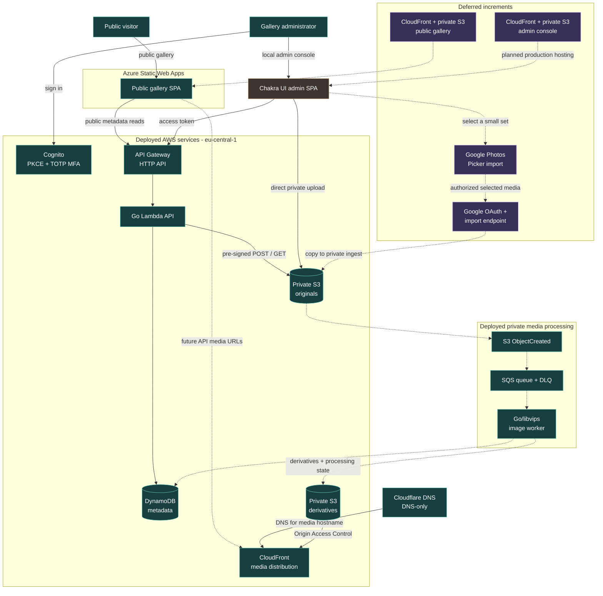

# Photo Portfolio

An immersive photo and art portfolio with cinematic Three.js gallery spaces,
plus a separate Chakra UI administration console. The public site is currently
available at [photo-gallery.i-dmytro.org](https://photo-gallery.i-dmytro.org).

## Current Status

The public Vite application includes a multistory home gallery, a dark drawing
room, a floating nature study, travel, artist presentation, contact route, and
a custom client-side 404 experience. Placeholder images remain in use while the
media upload pipeline is built.

The AWS metadata foundation is live in `eu-central-1`:

- API Gateway HTTP API and a modular Go Lambda API
- DynamoDB public read models and canonical private administrator records
- Cognito hosted login with PKCE, access-token scopes, and required TOTP MFA
- A Chakra UI administrator console for collection creation, editing, publish,
  archive, restore, guarded deletion, and photo CRUD source, including fixture
  previews and collection-scoped ordering
- Terraform-managed budget alerts and Cost Anomaly Detection

Private S3 originals, direct pre-signed uploads, automatic image metadata, and
short-lived administrator previews are also deployed and smoke-tested. The
S3-to-SQS Go/libvips worker is deployed: accepted JPEG/PNG/WebP inputs become
orientation-corrected, responsive WebP derivatives, while camera RAW remains
unsupported and source files never become public media. A live upload verified
the private `pending -> processing -> ready` flow, all three derivatives, and
the successful-processing lifecycle tag.

CloudFront now delivers only immutable WebP derivatives from private S3 through
Origin Access Control at `media.photo-gallery.i-dmytro.org`. Cloudflare is the
DNS provider for that hostname and remains DNS-only; it does not proxy media.
The distribution returns permissive, credential-free CORS headers so the
Azure-hosted Three.js gallery can safely load images as GPU textures. The
gallery still uses local metadata and placeholders until its API integration is
implemented, while the admin SPA remains local-only.

The collection restore flow is deployed and smoke-tested. Role-specific access
for additional administrators is an optional future capability.

## Infrastructure Architecture

Solid paths are deployed today. Dashed paths are deliberately deferred: Google
Photos import and production hosting for the public and administrator SPAs.



## Repository Layout

```text
src/                              public portfolio Vite application
apps/gallery-admin/               Cognito-protected Chakra UI console
services/gallery-api/             Go HTTP API and Lambda entry point
infrastructure/terraform/         AWS API, DynamoDB, Cognito, and budgets
scripts/package-gallery-api.sh    ARM64 Lambda packaging helper
THIRD_PARTY_NOTICES.md            Container dependency licence reminders
```

## Public Gallery Development

```bash
npm install
npm run dev
```

The gallery normally runs at `http://localhost:5173`.

```bash
npm run build
```

## Administrator Console

The console is a separate Vite application and normally runs at
`http://localhost:5174`.

```bash
cd apps/gallery-admin
npm install
cp .env.example .env.local
npm run dev
```

Set the Cognito values in `apps/gallery-admin/.env.local` from Terraform
outputs. These browser configuration values are not secrets; do not commit the
local environment file.

The console uses Cognito for authentication. Its API requests carry an access
token with `gallery/read`, `gallery/write`, or `gallery/publish` as appropriate.

## Gallery API

The Go service uses in-memory placeholder seed data locally. In Lambda it uses
the DynamoDB table named by `GALLERY_METADATA_TABLE`.

```bash
cd services/gallery-api
go test ./...
go run ./cmd/api
curl http://localhost:8080/health
```

Public metadata routes:

```text
GET /health
GET /collections
GET /collections/{slug}
GET /photos/{id}
```

Protected administrator routes currently cover collection CRUD/lifecycle and
photo CRUD/lifecycle source. Collection lifecycle is deliberate: drafts may publish,
published collections may archive only after published photos are moved or
archived, and archived collections are read-only. Restore returns an archived
collection to draft. Permanent deletion requires an
archived, empty collection and an exact-slug confirmation.

Photo records use the same draft/published/archived lifecycle. Existing
placeholder records preview their `/images/*` paths; newly uploaded originals
use a private, time-limited admin preview and cannot publish before processing
has produced a derivative. Photo deletion is intentionally deferred until it
can also clean up original and derivative S3 objects.

See [services/gallery-api/README.md](services/gallery-api/README.md) for the
seed command and API-specific notes.

## Infrastructure

Terraform uses a separate remote state configuration. The committed source does
not contain state, saved plans, or local backend configuration. Review and
apply Terraform manually from the Terraform directory:

```bash
cd infrastructure/terraform
terraform fmt -check
terraform validate
terraform plan -out=change.tfplan
terraform apply change.tfplan
```

The Lambda artifact must be rebuilt before planning an API deployment:

```bash
./scripts/package-gallery-api.sh
```

`terraform apply` is intentionally a developer-operated step.

## Next Work

1. Connect the Azure gallery to public API metadata and CloudFront media URLs,
   preserving local artwork as a fallback during the incremental migration.
2. Smoke-test the image-processing failure/retry/DLQ path.
3. Add selective Google Photos import through the Picker API, copying only
   administrator-selected images into the same private S3 processing flow.
4. Deploy public and admin builds to private S3 buckets behind CloudFront.
