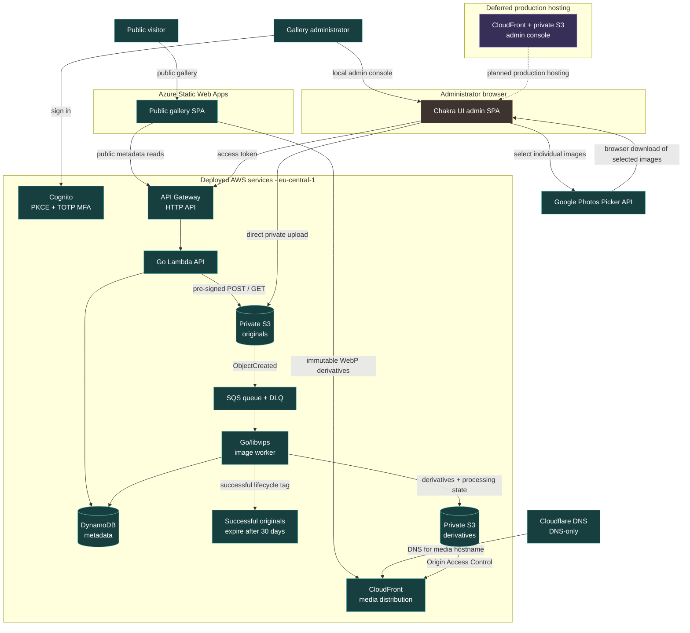

# Photo Portfolio

An immersive photo and art portfolio with cinematic Three.js gallery spaces,
plus a separate Chakra UI administration console. The public site is currently
available at [photo-gallery.i-dmytro.org](https://photo-gallery.i-dmytro.org).

## Current Status

The public Vite application includes a multistory home gallery, a dark drawing
room, a floating nature study, travel, artist presentation, contact route, and
a custom client-side 404 experience. It reads published collection metadata
from the API and displays CloudFront-hosted derivatives; bundled fixtures stay
available as a local-development and outage fallback.

The AWS metadata foundation is live in `eu-central-1`:

- API Gateway HTTP API and a modular Go Lambda API
- DynamoDB public read models and canonical private administrator records
- Cognito hosted login with PKCE, access-token scopes, and required TOTP MFA
- A Chakra UI administrator console for collection creation, editing, publish,
  archive, restore, guarded deletion, and full photo CRUD, including direct
  drag-and-drop uploads, Google Photos Picker imports, previews, ordering,
  retry processing, and asset-aware permanent deletion
- Terraform-managed budget alerts and Cost Anomaly Detection

Private S3 originals, direct pre-signed uploads, automatic image metadata, and
short-lived administrator previews are also deployed and smoke-tested. The
S3-to-SQS Go/libvips worker turns accepted JPEG/PNG/WebP inputs into
orientation-corrected, responsive WebP derivatives. Camera RAW remains
unsupported and originals never become public media. A processed original is
tagged for lifecycle expiry 30 days after upload. A failed or legacy-pending
upload can be sent back to SQS from the administrator console; deleting an
archived photo removes its private original and generated derivatives, then
invalidates the corresponding CloudFront cache path.

CloudFront now delivers only immutable WebP derivatives from private S3 through
Origin Access Control at `media.photo-gallery.i-dmytro.org`. Cloudflare is the
DNS provider for that hostname and remains DNS-only; it does not proxy media.
The distribution returns permissive, credential-free CORS headers so the
Azure-hosted Three.js gallery can safely load images as GPU textures. The
gallery can now read published metadata and CloudFront media from the API when
its Vite build receives `VITE_GALLERY_API_URL`; bundled images remain an
intentional fallback during an API outage or local development. The admin SPA
remains local-only.

The collection restore flow is deployed and smoke-tested. The administrator
console is currently used locally; a production admin deployment and
role-specific access for additional administrators remain future work.

### Home Gallery Selection

The desktop Home scene is an elevator of collection floors. A floor holds at
most seven framed works, which preserves the intended symmetric 3D composition
without distant frames being hidden behind nearer ones. The opening **Selected
Work** floor chooses featured photos round-robin across published collections,
starting with the highest display order in each collection. This gives every
collection a chance to appear before a collection receives a second slot.

Each collection floor is currently its first seven photos ordered by its
display order. The mobile version uses the same floors but renders a lighter
responsive contact sheet, showing up to six images per floor instead of WebGL.

## Infrastructure Architecture

Solid paths are deployed today. The only dashed path is the intentionally
deferred production deployment of the administrator SPA.



## Repository Layout

```text
src/                              public portfolio Vite application
apps/gallery-admin/               Cognito-protected Chakra UI console
services/gallery-api/             Go HTTP API and Lambda entry point
infrastructure/terraform/         AWS API, DynamoDB, Cognito, and budgets
scripts/package-gallery-api.sh    ARM64 Lambda packaging helper
THIRD_PARTY_NOTICES.md            Container dependency licence reminders
```

## Public Gallery Development

```bash
npm install
npm run dev
```

The gallery normally runs at `http://localhost:5173`.

To test the published-gallery integration locally, create `.env.local` with:

```bash
VITE_GALLERY_API_URL=https://m02dauw9h9.execute-api.eu-central-1.amazonaws.com
```

For the Azure production build, set the GitHub Actions repository variable
`GALLERY_API_BASE_URL` to that same public API origin. The value is public
configuration, not a secret.

```bash
npm run build
```

## Administrator Console

The console is a separate Vite application and normally runs at
`http://localhost:5174`.

```bash
cd apps/gallery-admin
npm install
cp .env.example .env.local
npm run dev
```

Set the Cognito values in `apps/gallery-admin/.env.local` from Terraform
outputs. These browser configuration values are not secrets; do not commit the
local environment file.

The console uses Cognito for authentication. Its API requests carry an access
token with `gallery/read`, `gallery/write`, or `gallery/publish` as appropriate.

### Google Photos Imports

The optional Google Photos control on **Add photos** uses the Google Photos
Picker API. It asks the administrator to select individual images, downloads
only those selections in the browser, and sends them through the same private
S3 upload and image-processing pipeline as drag-and-drop. No Google refresh
token is stored by this project.

To enable it, create a Google OAuth **Web application** client, enable the
**Google Photos Picker API**, and add `http://localhost:5174` plus the future
admin-console production origin as Authorized JavaScript origins. Set its
public client ID in `apps/gallery-admin/.env.local`:

```bash
VITE_GOOGLE_PHOTOS_CLIENT_ID=YOUR_GOOGLE_OAUTH_WEB_CLIENT_ID
```

The console requests only
`https://www.googleapis.com/auth/photospicker.mediaitems.readonly` when the
administrator starts an import. The Picker API is intentionally selected-item
access, not a general-purpose Google Photos gallery or CDN.

## Gallery API

The Go service uses in-memory placeholder seed data locally. In Lambda it uses
the DynamoDB table named by `GALLERY_METADATA_TABLE`.

```bash
cd services/gallery-api
go test ./...
go run ./cmd/api
curl http://localhost:8080/health
```

Public metadata routes:

```text
GET /health
GET /collections
GET /collections/{slug}
GET /photos/{id}
```

Protected administrator routes currently cover collection CRUD/lifecycle and
photo CRUD/lifecycle source. Collection lifecycle is deliberate: drafts may publish,
published collections may archive only after published photos are moved or
archived, and archived collections are read-only. Restore returns an archived
collection to draft. Permanent deletion requires an
archived, empty collection and an exact-slug confirmation.

Photo records use the same draft/published/archived lifecycle. Existing
placeholder records preview their `/images/*` paths; newly uploaded originals
use a private, time-limited admin preview and cannot publish before processing
has produced a derivative. A pending or failed upload may be retried from the
console. Permanent deletion requires an archived photo and an exact immutable
photo-ID confirmation; it removes the original, every generated derivative,
and the matching CloudFront cache path.

See [services/gallery-api/README.md](services/gallery-api/README.md) for the
seed command and API-specific notes.

## Infrastructure

Terraform uses a separate remote state configuration. The committed source does
not contain state, saved plans, or local backend configuration. Review and
apply Terraform manually from the Terraform directory:

```bash
cd infrastructure/terraform
terraform fmt -check
terraform validate
terraform plan -out=change.tfplan
terraform apply change.tfplan
```

The Lambda artifact must be rebuilt before planning an API deployment:

```bash
./scripts/package-gallery-api.sh
```

`terraform apply` is intentionally a developer-operated step.

## Next Work

1. Smoke-test the image-processing failure, retry, and DLQ path with an
   intentionally invalid input.
2. Deploy the administrator SPA behind CloudFront with an appropriate separate
   hostname and Cognito callback/logout URLs.
3. Revisit Home curation as the archive grows: retain the seven-frame scene
   cap, but decide whether collection floors should favour newest photos or
   rotate their selection.
4. Optionally add Cognito groups for a photo-only editor role after the core
   administration workflow is settled.
